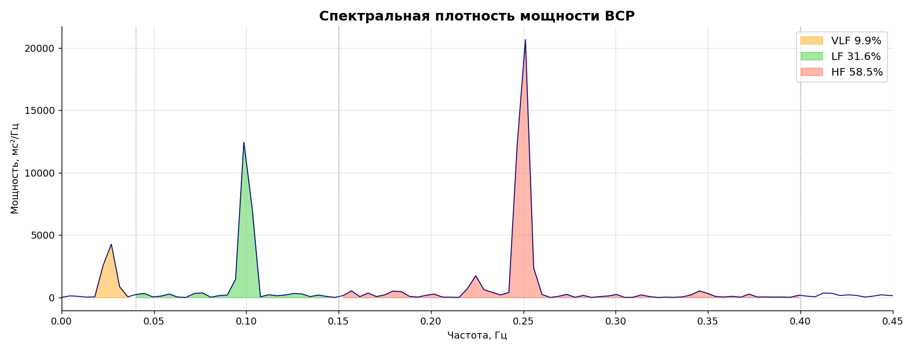
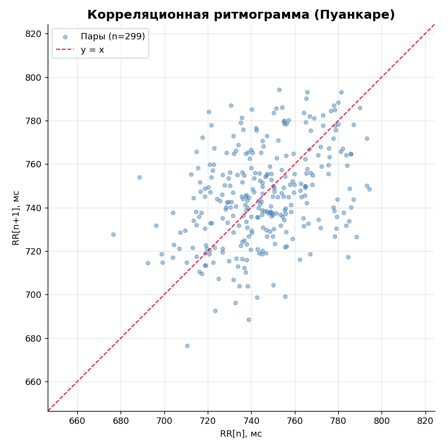
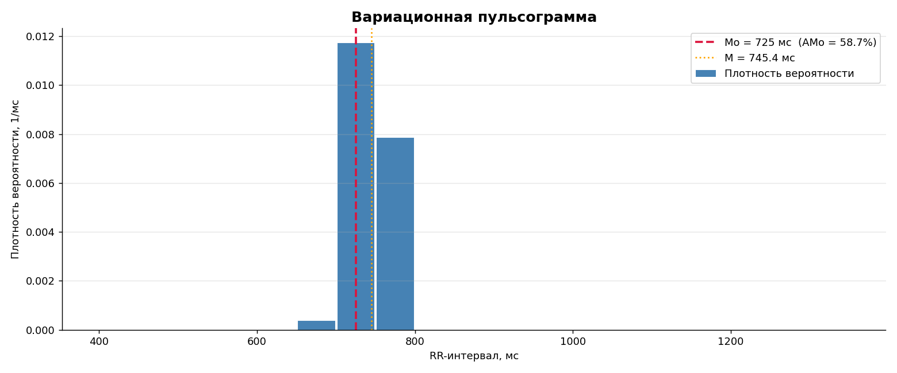

# HRV Analysis Pipeline

Полный пайплайн анализа вариабельности сердечного ритма (ВСР) в Python.
Реализованы статистические, геометрические, корреляционные и спектральные методы,
а также комплексная оценка ПАРС по Баевскому.

[English version](README_EN.md)

## Что внутри

| Раздел | Метод | Показатели |
|---|---|---|
| 1 | Статистический анализ | HR, SDNN, CV, RMSSD, pNN50 |
| 2 | Геометрический анализ | Мо, АМо, MxDMn, индекс напряжения SI |
| 3 | Корреляционный анализ | CC1, CC0, скаттерограмма Пуанкаре |
| 4 | Спектральный анализ (FFT) | VLF, LF, HF, IC, LF/HF, ISCA |
| 5 | Комплексная оценка | ПАРС (1–10 баллов) |

## Технологии и подход

- **Спектральный анализ:** кубическая сплайн-интерполяция → детрендинг → окно Хана → FFT → интегрирование по диапазонам методом трапеций.
- **Скаттерограмма (Пуанкаре):** один из ключевых методов для детектирования эктопических сокращений.
- **ПАРС:** комплексный балльный показатель функционального состояния по российскому стандарту (Баевский Р. М.).
- **Стек:** NumPy, SciPy (`CubicSpline`, `numpy.fft`), pandas, matplotlib.

## Результаты на демо-данных

| Показатель | Значение | Норма |
|---|---|---|
| HR | 80.5 уд/мин | 60–80 |
| SDNN | 21.9 мс | 40–80 |
| RMSSD | 24.5 мс | 20–50 |
| pNN50 | 4.7% | > 20 |
| ИН (SI) | 343.5 у.е. | 80–150 |
| LF/HF | 0.54 | 0.5–2 |





## Как запустить

```bash
git clone https://github.com/<username>/hrv-analysis.git
cd hrv-analysis
pip install -r requirements.txt
jupyter notebook hrv_pipeline.ipynb
```

## Структура

```
hrv-analysis/
├── hrv_pipeline.ipynb      # основной ноутбук
├── data/
│   └── rr_intervals.csv    # пример данных (синтетический)
├── figures/                # графики, сохраняемые ноутбуком
├── requirements.txt
├── README.md  / README_EN.md
└── LICENSE
```

## Свои данные

Замени `data/rr_intervals.csv` на файл с одним столбцом RR-интервалов в миллисекундах (без заголовка). Строки, начинающиеся с `#`, игнорируются.

## Литература

- Bayevsky R. M. (2001). Analysis of heart rate variability in space medicine. *Human Physiology*.
- Task Force of the European Society of Cardiology (1996). Heart rate variability. *Circulation*, 93(5), 1043–1065.
- Shaffer F., Ginsberg J. P. (2017). An overview of heart rate variability metrics and norms. *Frontiers in Public Health*, 5:258.

## Автор

Анастасия Бирдина · birdinanastia@gmail.com

## Лицензия

MIT — см. [LICENSE](LICENSE).
